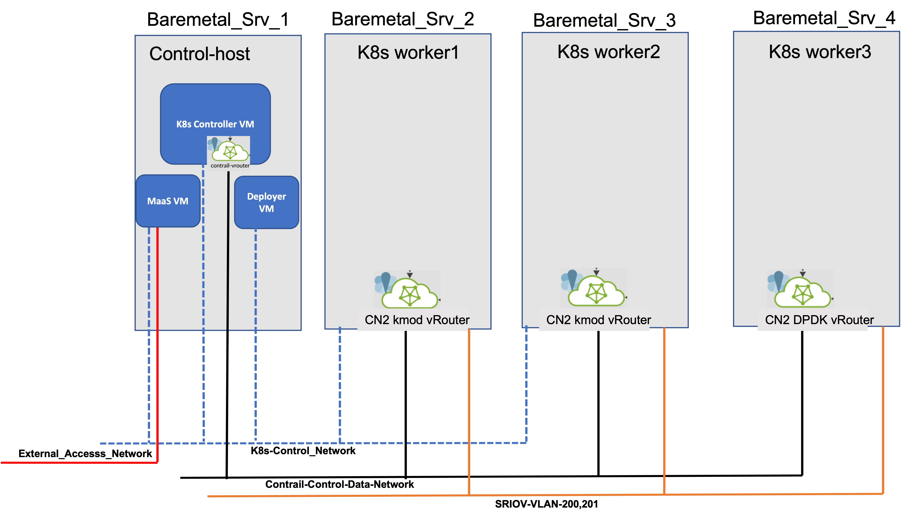

# Juniper CN2 DPDK vRouter Bringup

## Problem Statement
* In one of  previous wiki [Juniper CN2 Bring up over MaaS Managed infrastructre](https://github.com/kashif-nawaz/Juniper_CN2_K8s_Over_MaaS_Managed_Infra); I have discussed how to bring up Juniper CN2 CNI on MaaS managed bare metal and virtual infrastructure.
* But it was a very simple deployment (only kernel mode vRouter) was deployed and that too over shared network with K8s Control Plan.
* But what if CNF requires DPDK PMD bound interface on K8s worker nodes in order to attach POD interfaces with DPDK PMD for throughput hungry workloads.
## Solution
* Juniper CN2 (Cloud Native SDN Solution) offers DPDK vRouter to meet throughput needs of performance oriented containerized work loads. 
## Implementation Details 
   
  ### Work Flow:-
  - Bootstrap your infrastructure with your favourite tool.
  - Bring up K8s cluster with your favourite deployment method.
  - Ensure that Multus (meta CNI) is also enabled on k8s cluster.
  - Add DPDK Support on Host OS Kernel by editing the grub file and also by adding the required number of huge pages.
  - Isolate the DPDk Forwarding, Services and Control threads from the host OS scheduler.
  - Load DPDK PMD kernel driver supported by your NIC.
  - Reboot the worker nodes.
  - Prepare the CN2 Deployer file.
  - Add an appropriate label to DPDK worker node.
  - Kick off the CN2 deployment. 
  - Verfy the deployment status. 
  ### Boot Strapping Infrasture 
  * How to bootstrap bare metal and virtualized infrastructure with the help of Canonical MaaS  is described in [Ref](https://github.com/kashif-nawaz/Juniper_CN2_K8s_Over_MaaS_Managed_Infra) 
  ### Bring UP K8s Cluster 
  * In the above wiki I have also discussed how to bring up k8s cluster by using Kube spray, then adding Juniper Networks Cloud Native CNI (CN2) with  Multus CNI enabled on the cluster. 
  ### Add DPDK Support in Grub File 
  * Edit the grub file 
  ```
  sed -i  's/GRUB_CMDLINE_LINUX_DEFAULT=""/GRUB_CMDLINE_LINUX_DEFAULT="default_hugepagesz=1G hugepagesz=1G hugepages=16 iommu=pt intel_iommu=on"/g' /etc/default/grub
  update-grub
  ```
  ### Load DPDK Poll Mode Driver
  [Ref](https://www.juniper.net/documentation/us/en/software/cn-cloud-native22/cn-cloud-native-feature-guide/cn-cloud-native-network-feature/topics/concept/dpdk-vrouter.html)
  [Ref](https://doc.dpdk.org/guides/linux_gsg/linux_drivers.html)
  * Juniper CN2 DPDK vRouter supports vfio-pci and uio_pci_generic.
  * NIC available in my setup only supports uio_pci_generic.
  ```
  apt install linux-modules-extra-$(uname -r)
  modporb uio_pci_generic
  lsmod | grep uio_pci_generic
  ls -larth /lib/modules/$(uname -r)/kernel/drivers/uio/
  ```
  ### Prepare Deployer File 
  * Get the CN2 manifest archive from Juniper [Ref](https://support.juniper.net/support/downloads/)
  * Untar the archive and update the deployer file as per your enviornment [Ref](https://www.juniper.net/documentation/us/en/software/cn-cloud-native22/cn-cloud-native-k8s-install-and-lcm/topics/topic-map/cn-cloud-native-k8s-install-single-cluster-multi-net.html)

  ```
   tar xfv contrail-manifests-k8s-22.3.0.71.tgz
  ```
  * Add credentials to the deployer file to download container images from the Juniper Container images repository [Ref](https://www.juniper.net/documentation/us/en/software/cn-cloud-native22/cn-cloud-native-k8s-install-and-lcm/topics/task/cn-cloud-native-k8s-configure-secrets.html).

  * Add separate Data and Control Network for CN2 (k8s Control Plane will use separate network, please refer above diagram).
    ```
    vim contrail-manifests-k8s/single-cluster/single_cluster_deployer_example.yaml
      ---
    apiVersion: v1
    kind: ConfigMap
    metadata:
      name: contrail-network-config
      namespace: contrail
    data:
      networkConfig: |
        controlDataNetworks:
        - subnet: 192.168.5.0/24
          gateway: 192.168.5.1
    ```
  * Add Appropiate Hugepage for DPDK node, by default 3Gi  Hugepages is referred in deployer file, but for the production grade environment 6Gi is recommended.

    ```
    vim contrail-manifests-k8s/single-cluster/single_cluster_deployer_example.yaml
    find following 
      resources:
                limits:
                  hugepages-1Gi: 3Gi
                requests:
                  memory: 3Gi
      and replace above  with the following

      resources:
                limits:
                  hugepages-1Gi: 6Gi
                requests:
                  memory: 6Gi
    ```
  * Change DPDK PMD value in deployer (by default it is vfio-pci), hence NICs in my setup support only uio_pci_generic DPDK PMD so I will change it accordingly.

    ```
    vim contrail-manifests-k8s/single-cluster/single_cluster_deployer_example.yaml
    dpdk:
          
            #dpdkUioDriver: vfio-pci
            dpdkUioDriver: uio_pci_generic
    ```

  * Review DPDK Forwarding, Services and Control thread cores in deployer file and change it as per your setup, default values are.

    ```
    dpdk:
            cpuCoreMask: 2,3
            dpdkCommandAdditionalArgs: --yield_option 0
            dpdkCtrlThreadMask: 4,5
            serviceCoreMask: 4,5 
    ```
  * Ensure above referred CPU Core are isolated from the Host OS scheduler by editing the grub file or by applying appropriate tuned profile.
  * In another wiki [Ref](https://github.com/kashif-nawaz/CNF_BMS_Infra_Slicing); I have described how to find the CPU NUMA topology and how to isolate CPU cores from the host OS scheduler

  ### Add Label to DPDK Worker Node 
  [Ref link](https://www.juniper.net/documentation/us/en/software/cn-cloud-native22/cn-cloud-native-k8s-install-and-lcm/topics/topic-map/cn-cloud-native-k8s-install-single-cluster-multi-net.html)
  * CN2 22.2 DPDK nodes requires following label

    ```
    kubectl label node <node-name> chassis=dpdk-worker
    ```
  * CN 22.3 DPDK nodes requires following label 
    ```
    kubectl label node <node-name> agent-mode=dpdk
    ```

  ### Deployment 
  * Deploy CN2 cluster with kubectl command 

    ```
    kubectl apply -f contrail-manifests-k8s/manifests/single_cluster_deployer_example.yaml
    ```
  ### Verfication
  * Check worker nodes status
    ```
    kubectl get nodes -o wide
    NAME          STATUS   ROLES                  AGE     VERSION   INTERNAL-IP      EXTERNAL-IP   OS-IMAGE             KERNEL-VERSION     CONTAINER-RUNTIME
    controller1   Ready    control-plane,master   2d19h   v1.23.5   192.168.24.112   <none>        Ubuntu 20.04.3 LTS   5.4.0-97-generic   containerd://1.6.8
    worker1       Ready    <none>                 2d19h   v1.23.5   192.168.24.113   <none>        Ubuntu 20.04.3 LTS   5.4.0-97-generic   containerd://1.6.8
    worker2       Ready    <none>                 2d19h   v1.23.5   192.168.24.114   <none>        Ubuntu 20.04.3 LTS   5.4.0-97-generic   containerd://1.6.8
    worker3       Ready    <none>                 2d19h   v1.23.5   192.168.24.115   <none>        Ubuntu 20.04.3 LTS   5.4.0-97-generic   containerd://1.6.8
    ```
* Check POD Status 
  ```
  kubectl get pods -o wide -n contrail
  NAME                                        READY   STATUS    RESTARTS      AGE     IP               NODE          NOMINATED NODE   READINESS GATES
  contrail-control-0                          2/2     Running   0             2d16h   192.168.24.112   controller1   <none>           <none>
  contrail-k8s-kubemanager-58594fdd54-lqcgb   1/1     Running   0             2d16h   192.168.24.112   controller1   <none>           <none>
  contrail-vrouter-dpdk-nodes-cn2ks           4/4     Running   8 (27h ago)   2d16h   192.168.24.115   worker3       <none>           <none>
  contrail-vrouter-masters-cxqm4              3/3     Running   0             2d16h   192.168.24.112   controller1   <none>           <none>
  contrail-vrouter-nodes-bqtnx                3/3     Running   4 (27h ago)   2d16h   192.168.24.114   worker2       <none>           <none>
  contrail-vrouter-nodes-cvqhx                3/3     Running   3 (27h ago)   2d16h   192.168.24.113   worker1       <none>           <none>

  kubectl get pods -o wide -n contrail | grep vrouter-dpdk
  contrail-vrouter-dpdk-nodes-cn2ks           4/4     Running   8 (27h ago)   2d16h   192.168.24.115   worker3       <none>           <none>

  kubectl get pods -o wide -n contrail | grep vrouter
  contrail-vrouter-dpdk-nodes-cn2ks           4/4     Running   8 (27h ago)   2d16h   192.168.24.115   worker3       <none>           <none>
  contrail-vrouter-masters-cxqm4              3/3     Running   0             2d16h   192.168.24.112   controller1   <none>           <none>
  contrail-vrouter-nodes-bqtnx                3/3     Running   4 (27h ago)   2d16h   192.168.24.114   worker2       <none>           <none>
  contrail-vrouter-nodes-cvqhx                3/3     Running   3 (27h ago)   2d16h   192.168.24.113   worker1       <none>           <none>
  ```
* Verify if DPDK worker node interface is bound with DPDK PMD

  ```
  python3 dpdk-devbind -s

  Network devices using DPDK-compatible driver
  ============================================
  0000:01:00.0 'Ethernet Controller 10-Gigabit X540-AT2 1528' drv=uio_pci_generic unused=ixgbe,vfio-pci

  Network devices using kernel driver
  ===================================
  0000:01:00.1 'Ethernet Controller 10-Gigabit X540-AT2 1528' if=eno2 drv=ixgbe unused=vfio-pci,uio_pci_generic
  0000:01:10.1 'X540 Ethernet Controller Virtual Function 1515' if=eno2v0 drv=ixgbevf unused=vfio-pci,uio_pci_generic
  0000:01:10.3 'X540 Ethernet Controller Virtual Function 1515' if=eno2v1 drv=ixgbevf unused=vfio-pci,uio_pci_generic
  0000:01:10.5 'X540 Ethernet Controller Virtual Function 1515' if=eno2v2 drv=ixgbevf unused=vfio-pci,uio_pci_generic
  0000:01:10.7 'X540 Ethernet Controller Virtual Function 1515' if=eno2v3 drv=ixgbevf unused=vfio-pci,uio_pci_generic
  0000:01:11.1 'X540 Ethernet Controller Virtual Function 1515' if=eno2v4 drv=ixgbevf unused=vfio-pci,uio_pci_generic
  0000:01:11.3 'X540 Ethernet Controller Virtual Function 1515' if=eno2v5 drv=ixgbevf unused=vfio-pci,uio_pci_generic
  0000:01:11.5 'X540 Ethernet Controller Virtual Function 1515' if=eno2v6 drv=ixgbevf unused=vfio-pci,uio_pci_generic
  0000:01:11.7 'X540 Ethernet Controller Virtual Function 1515' if= drv=ixgbevf unused=vfio-pci,uio_pci_generic
  0000:08:00.0 'I350 Gigabit Network Connection 1521' if=eno3 drv=igb unused=vfio-pci,uio_pci_generic *Active*
  0000:08:00.1 'I350 Gigabit Network Connection 1521' if=eno4 drv=igb unused=vfio-pci,uio_pci_generic *Active*
  ```